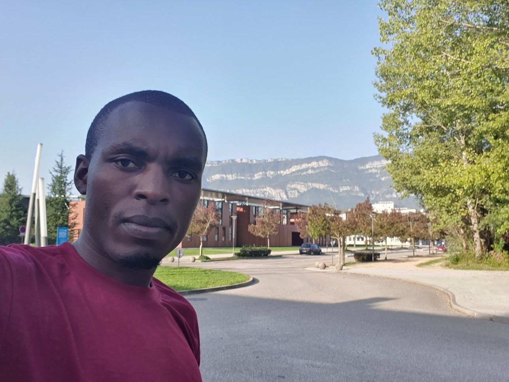

# Hello, I'm Nibishaka Jean Felix 👋

## About Me

I'm an electronics and telecommunication engineer with a strong background in
mathematics and physics. Currently, I'm embarking on a new journey as a trainee
at Hock Your Future Belgium, where I am immersed in the world of web design. My
goal is to leverage this learning experience to contribute to the design of
various web applications, applying my skills in the field of communication.

## More About Me

- 💼 Electronics and Telecommunication Engineer
- 📚 Background in Mathematics and Physics
- 🌐 Currently learning Web Design at Hock Your Future Belgium
- 🎓 Experienced in programming languages: C, C++, MATLAB, Python, Fortran
- 💻 Proficient in using Microsoft products: Excel, Office, PowerPoint, 365
- 📝 Familiar with LaTeX for scientific writing

## Interests and Hobbies

In my free time, I enjoy watching documentary movies to broaden my knowledge and
perspective.
